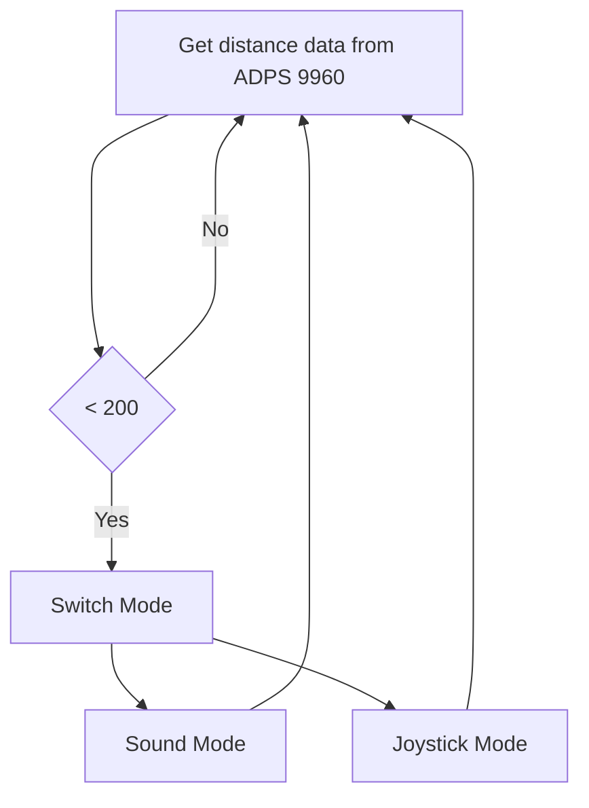
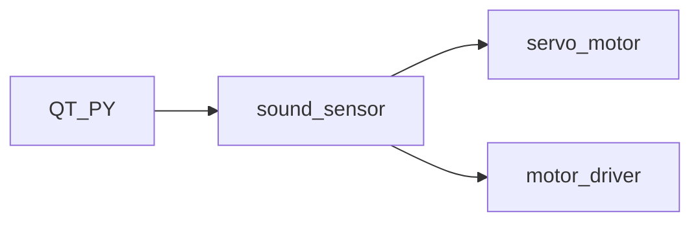

# Codes

### System diagram:

### Our final deliverable codes logic

use APDS sensor(proxomity) to control/switch between 2 modes: 1. sound mode, 2. joystick mode. Waving the hand at the apds will switch one mode to another.

### Codes Development Process
Attached below is the proposed idea of Wrangler(which is a bit different from the final deliverable). The proposed model is cute and interesting. We were thinking using a motion sensor APDS9960 to control the Wrangler to move in different directions. 

First thing we did was to plan the use of the pins of the QT PY 2040 board. We read through the datasheet and allocated the pins and memories for different uses. The pins are assigned as below:

 

We started from making each small module work and then combined them altogether. They can be summarized as 

After coding, configuring, testing all the broke-down functions mentioned, we mounted them onto the chassis. The breadboard was secured on the first layer of acylic board on the chassis, the wires were carefully arranged for clarity and ease of debugging. The second layer of acrylic board was used hold the "wrangler" toy for a better visual prospective.

  

Then we tried to test the functions in an integrated manner by redesigning the C file, Cmake files and code structures. After failing due to a few bugs, we managed to get functions working. However, there are still structural problems that we found out during the process. The wrangler was placed too high and when the motors drive the chassis to move, especially forward,  the Wrangler loss balance. Thus, we decided to implement some weights at the bottom layer to lower the center of gravity and adjusting the running interval of motor for a smoother movement. 

The final deliverable looks like this: 

   

**So, the final deliverable codes logic is:**

use APDS sensor(proxomity) to control/switch between 2 modes: 1. sound mode, 2. joystick mode. Waving the hand at the apds will switch one mode to another.

### Check here to download all the codes in .zip:

https://github.com/skyfall88888/ESE519-FinalProj/blob/main/Wrangler.zip

